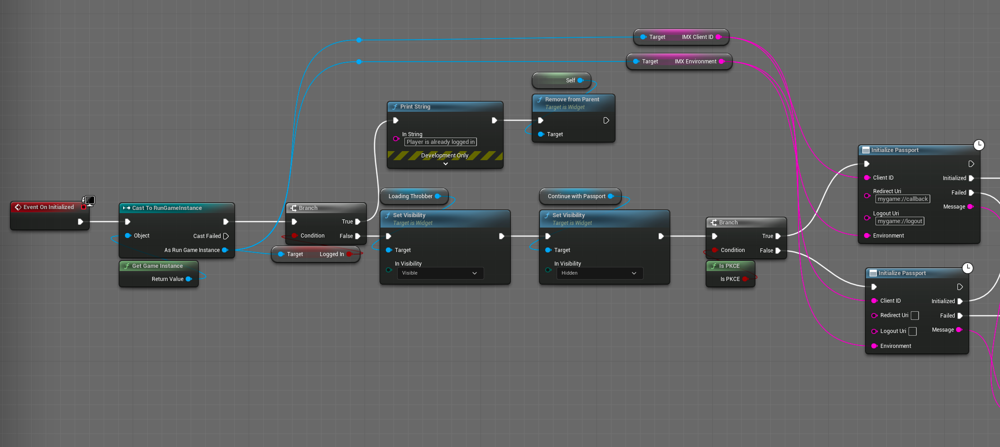
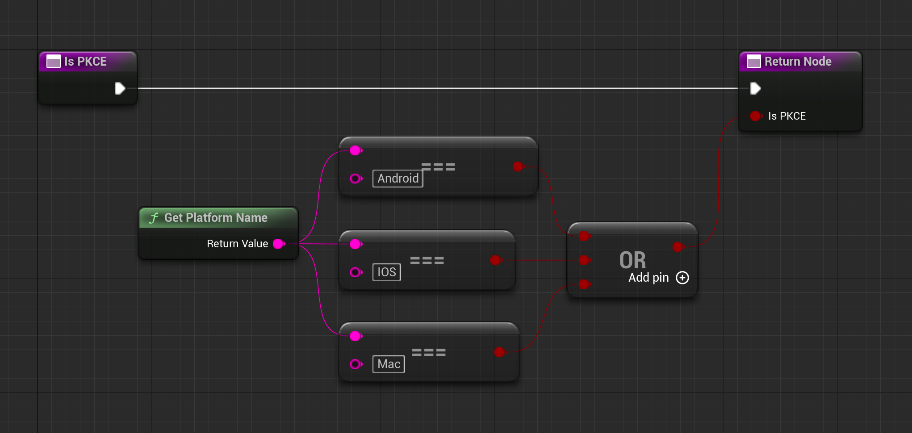
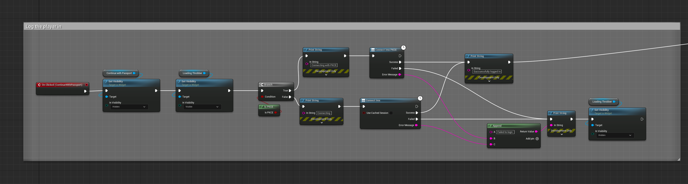
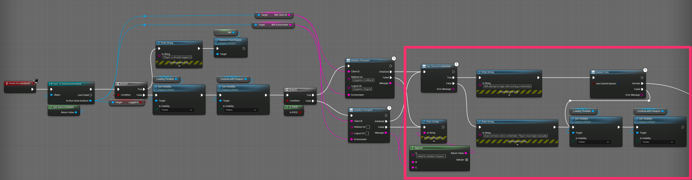

# 04 - Log the Player in with the Immutable Passport

## Introduction

In this lesson, we will integrate player login functionality using the Immutable Passport within Unreal Engine. This step enables player authentication, a foundational feature for interacting with blockchain elements like NFTs. We will start by initializing the passport, then implement the login process, and finally add silent authentication for a smoother user experience.

## Lesson Objective

By the end of this lesson, you will be able to:
- Initialize the Immutable Passport in Unreal Engine.
- Implement player login functionality using the Immutable Passport.
- Add silent authentication to enhance user experience.

## Prerequisites

Before starting this lesson, ensure you have completed the previous lesson on [**Register the Game on the Immutable Hub**](../03-register-the-game-on-the-immutable-hub/README.md).

## Step-by-Step Instructions

### 1. Initialize the Immutable Passport

First, we need to initialize the Immutable Passport. Follow these steps:

1. **Add a New Boolean Variable**:
   - Open your game instance and add a new boolean variable named `isLoggedIn`. This will track whether the player is already logged in.

2. **Open the Login Widget Blueprint**:
   - Find and open the login widget blueprint.
   - Switch to the event graph tab.

3. **Add Initialization Logic**:
   - Retrieve the game instance and cast it to your custom `RunGameInstance`.
   - Get the `isLoggedIn` variable and create a branch.
     - If `isLoggedIn` is true, remove the login widget from the parent since the player is already logged in.
     - If `isLoggedIn` is false, proceed to initialize the Immutable Passport.
   - Show the loading spinner and hide the login button while the passport is initializing.

4. **Initialize the Passport Based on Device**:
   - Use the custom `isPKCE` function to determine the appropriate login method.
   - Create a branch based on the return value of `isPKCE`:
     - If true, initialize the passport with the client ID, redirect URI, logout URI, and environment.
     - If false, initialize the passport with just the client ID and environment.

### 2. Implement Login Logic

Next, we need to implement the login logic triggered by the login button:

1. **Setup Login Button Click Event**:
   - In the login button click event, show the loading spinner and hide the login button.
   - Use the `isPKCE` function again to determine the login method.
   - Create a branch based on `isPKCE`:
     - If true, use the `Connect IMX PKCE` node to trigger the login flow.
     - If false, use the `Connect IMX` node.
   - Handle the success and failure cases:
     - On success, print a success message and remove the login widget from the parent.
     - On failure, print a failure message and reset the spinner and login button visibility.

### 3. Add Silent Authentication

To enhance the login experience, add logic to use stored credentials for automatic login:

1. **Check for Stored Credentials**:
   - Going back to the `On Construct` Event
   - After initializing the passport, check if the player has stored credentials.
   - If not, allow manual login as previously implemented.
   - If stored credentials are found, attempt to log in automatically using the `Connect IMX` node with "Use cached session" set to true.

2. **Handle Automatic Login**:
   - On successful login, remove the login widget and show the main menu.
   - On failure, fallback to the manual login flow.

## Expected Behavior

1. **Initialize and Run the Game**:
   - Run the game and observe the passport initialization process. The loading spinner should appear briefly.
   - Click the login button to trigger the login flow. Ensure the login process completes and the player is directed to the main menu.

2. **Automatic Login**:
   - Restart the game to test the automatic login using stored credentials. The player should be logged in automatically without manual input.

## Conclusion

In this lesson, we successfully integrated player login using the Immutable Passport. We initialized the passport, implemented the login process, and added silent authentication for a seamless user experience.

## Next Steps

In the next lesson, we will retrieve data from the player's account, including wallet information and NFTs, and display it on a profile screen. [**Retrieve Player Data with Immutable Passport**](../05-retrieve-player-data-with-immutable-passport/README.md)
