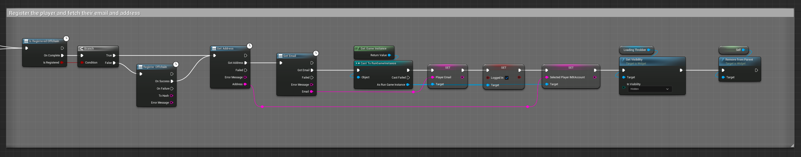
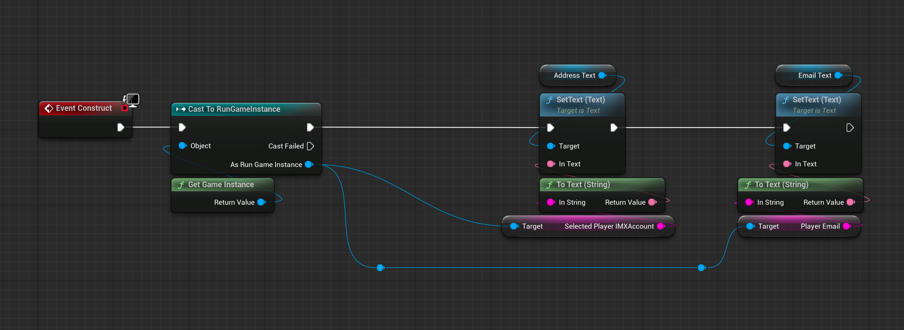

# Retrieve Player Data with Immutable Passport

## Introduction
In this lesson, we will enhance our game by integrating player data retrieval utilizing the Immutable Passport. This functionality is key for personalizing the player experience, allowing us to display important player information such as wallet addresses and email addresses directly within the game.

## Lesson Objective
By the end of this lesson, you will be able to:
- Update the game instance to store player details such as wallet address and email.
- Enhance the login widget to retrieve these player details during the login process.
- Update the profile widget to display the retrieved player details.

## Overview
We will follow these steps to achieve our objective:
1. Update the game instance to store player details.
2. Enhance the login widget to retrieve player data.
3. Update the profile widget to display the retrieved data.

## Prerequisites
Before starting this lesson, make sure you have completed the previous lesson: [Log the Player in with the Immutable Passport](../04-log-the-player-in-with-the-immutable-passport/README.md). In the last lesson, we implemented player login functionality using Immutable Passport, enabling players to log in to the game securely.

## Step-by-Step Instructions

### Update the Game Instance
First, we need to update the game instance blueprint to store the player's email and IMX address. So we can store the values on login and then use them again later.

Add two new variables:
* `playerEmail` (String)
* `playerIMXAddress` (String).

### Enhance the Login Widget to Retrieve Data
Next, we will enhance the login widget to retrieve the player's email and IMX address during the login process.

1. Extend the successful login flow to integrate the `Is Registered Offchain` node to check if the player is registered.
   - If the player is not registered, use the `Register Off Chain` node to register the player.
2. Use the `Get Address` and `Get Email` nodes to retrieve the player's IMX address and email.
3. Store these details in the game instance by casting it to the specific game instance and setting the `playerIMXAddress` and `playerEmail` variables.
4. Ensure the login process completes smoothly by closing the login widget and transitioning to the main menu.

**Make sure you connect both the manual and automatic login flows to this new logic. It's important to make sure the player is registered to retrieve their data regardless of the method of authentication.**

### Update the Profile Widget
Now, we will update the profile widget to display the player's email and IMX address.

1. Open the profile widget blueprint.
2. On the `Construct` event, retrieve the game instance and cast it to the specific game instance.
3. Update the text fields in the profile widget to read the `playerIMXAddress` and `playerEmail` from the game instance.

## Expected Behavior
After making these changes, we expect to see the player's details on the profile page.

1. Log in and navigate to the profile page.
2. Verify that the player's email and IMX address are displayed correctly.
3. Ensure that the data retrieval works for both manual and saved credentials login flows.

## Conclusion
In this lesson, we enhanced our game by integrating player data retrieval using the Immutable Passport. We updated the game instance to store player details, enhanced the login widget to retrieve this data, and updated the profile widget to display it. This personalizes the player experience and ensures important information is readily accessible within the game.

## Next Steps
In the next lesson, we will implement player logout functionality. This will complete the login flow and ensure a seamless user experience. [Player Logout](../06-player-logout/README.md)