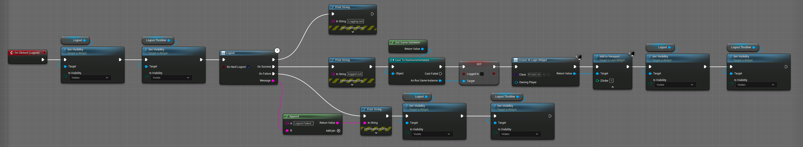

# 06. Player Logout

## Introduction
Welcome back to our course on integrating NFTs into your Unreal Engine game using Immutable's SDK. Today, we will focus on implementing the logout functionality. Ensuring players can securely and efficiently end their sessions is crucial, especially when handling sensitive data like blockchain wallets and NFTs.

## Lesson Objective
By the end of this lesson, you will be able to implement a secure logout functionality using Immutable Passport in Unreal Engine, ensuring players can securely log out of the game.

## Overview
In this lesson, we will:
1. Implement the logout functionality using Immutable Passport.
2. Demonstrate the current state without proper logout.
3. Update the main menu widget to include logout logic.
4. Demonstrate a successful logout process.

## Prerequisites
Before starting this lesson, make sure you have completed the previous lesson on [**Retrieve Player Data with Immutable Passport**](../05-retrieve-player-data-with-immutable-passport/README.md). In that lesson, we fetched player wallet information and NFTs, displaying the player details on a "Profile" screen.

## Step-by-Step Instructions

### Update the Main Menu Widget
First, we need to update the main menu widget to add the logout logic, ensuring a seamless user experience when logging out.

1. **Add Logic for Logout Button Clicked Event**:
   - **Hide Logout Button**: Set the logout button's visibility to hidden to indicate an action is in progress.
   - **Show Loading Throbber**: Make the loading throbber visible to signal that the logout process is underway.

2. **Use Immutable Logout Node**:
   - Add the `Immutable Logout` node to initiate the logout process.
      - Optionally set whether you want to do a hard logout where the player is navigated to the browser to logout

3. **Handle Logout Success**:
   - **Get Game Instance**: Retrieve the game instance and set the `loggedIn` variable to `false`.
   - **Create and Show Login Widget**: Create the login widget and add it to the viewport, redirecting players to the login screen.
   - **Reset UI Elements**: Ensure the visibility of the login button and loading throbber are reset for the next login attempt.

4. **Handle Logout Failure**:
   - Reset the visibility of the login button and loading throbber, allowing players to attempt logout again.

## Expected Behaviour
1. **Run the Game**: Start the game and verify that you are taken to the main menu with saved credentials.
2. **Trigger Logout**: Click the logout button and complete the process in the browser.
3. **Verify Logout**: Ensure the game shows the login screen upon successful logout.
4. **Re-run the Game**: Restart the game to confirm it no longer auto-logs in with saved credentials.
5. **Login Again**: Log in again to ensure the login functionality works correctly and returns you to the main menu.

## Conclusion
In this lesson, we successfully implemented a secure logout process using Immutable Passport in Unreal Engine. This feature enhances the security and user experience by effectively managing session data.

## Next Steps
In the next lesson, we will delve into the architecture of minting NFTs. Stay tuned as we continue to enhance our game with exciting blockchain features. [**Overview of Minting Architecture**](../07-overview-of-minting-architecture/README.md).
