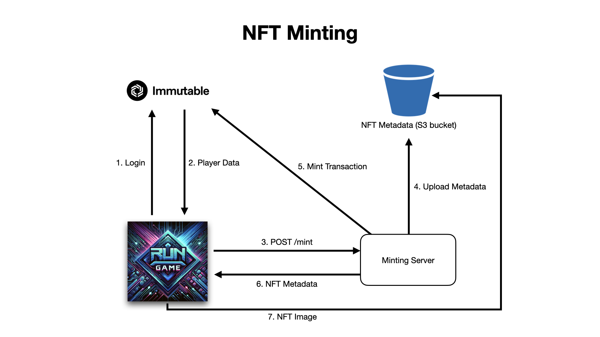
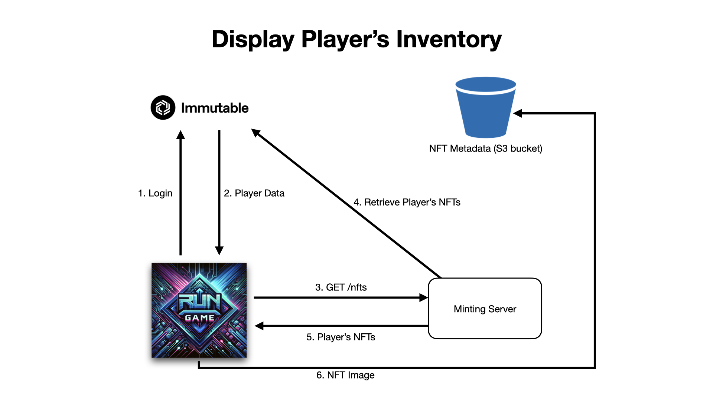

# Lesson 7: Overview of Minting Architecture

## Introduction

In this lesson, we will explore the architecture required to add NFT minting functionality to our game. The focus will be on understanding the overall architecture, providing a clear picture of how minting will be integrated.

## Overview

The goal of this lesson is to provide you with a clear understanding of the overall architecture for minting NFTs within "Trash Dash". Here's an overview of what we'll cover in this lesson:

1. We’ll conceptually explore the expansion of our Immutable Passport integration
2. How to allow minting rewards as NFTs
3. How players can utilize NFTs in the game

## Prerequisites
Before diving into this lesson, ensure you are familiar with our existing integration of Immutable Passport in our game. If you are not, you can check out this lesson for [player logout](../06-player-logout/README.md).

## Current State of the Game
Currently, our game has basic integration with Immutable Passport, allowing players to log in and fetch basic details. We aim to expand this by introducing NFTs. Specifically, we'll focus on converting accessories into NFTs. Players will be able to receive these accessories as NFTs for completing missions, view them in an inventory screen, and equip them via the loadout page.

## Proposed Minting Architecture
- **Existing Framework**: The game currently communicates directly with Immutable for player logins and data retrieval.
- **Minting Server**: We will introduce a dedicated server for minting NFTs, controlled and secure, to avoid direct player access to minting permissions.
- **Storage Solution**: An Amazon S3 bucket will be used for storing NFT metadata.
- **Security Note**: For tutorial simplicity, we will run the minting server locally without additional security layers, though this is not recommended for operational games which should be deployed in a secure production environment.

## Minting Process
1. **Login**: The game logs the player in with the Immtuable Passport.
2. **Player Data**: The player's account details are retrieved using the Immutable Passport.
3. **POST /mint**: The game sends a request to the minting server with the player's account details.
4. **Upload Metadata**: Concurrently with the minting process, the NFT's metadata is uploaded.
5. **Minting Transaction**: The server uses the Immutable SDK to initiate the minting process.
6. **NFT Metdata**: The server then sends this NFT and it's metadata back to the game.
7. **NFT Image**: A call is made to the S3 bucket to render the NFT's image.

## Displaying NFTs in Player Inventory
To display NFTs in the player's inventory, we follow a process similar to the minting workflow, involving several key steps:
1. **Login**: The game logs the player in with the Immtuable Passport.
2. **Player Data**: The player's account details are retrieved using the Immutable Passport.
3. **GET /nfts**: The game initiates a request to our minting server, passing the player's account details.
4. **Retrieve Player's NFTs**: The server, in turn, communicates with Immutable to request the player's NFT data.
5. **Player's NFTs**: The server then sends this NFT data back to the game.
6. **NFT Image**: A call is made to the S3 bucket to render the NFT's image.

## Conclusion
We've outlined a comprehensive architectural plan for integrating NFT minting and displaying them in player inventory in "Trash Dash". This sets the stage for enhancing the game with NFT integration.

## Next Steps

In the next lesson, we will set up an AWS S3 bucket for storing NFT metadata. [Deploy S3 Bucket for NFT Metadata with AWS CDK](../08-deploy-s3-bucket-for-nft-metadata-with-aws-cdk/README.md).
