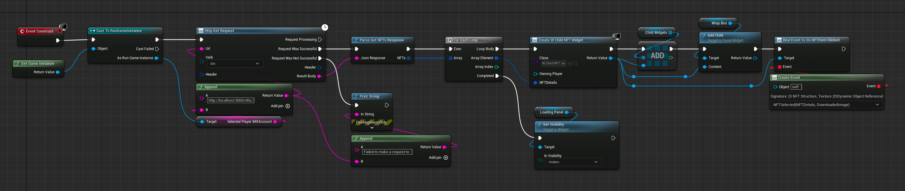
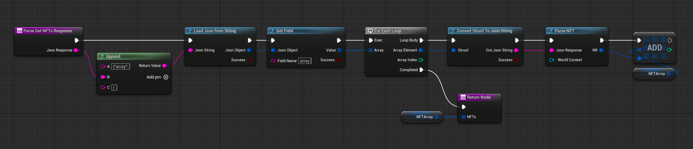
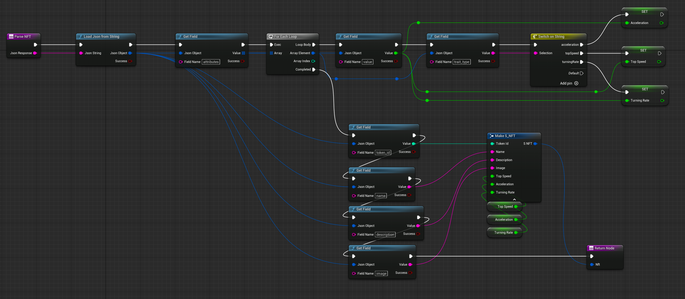
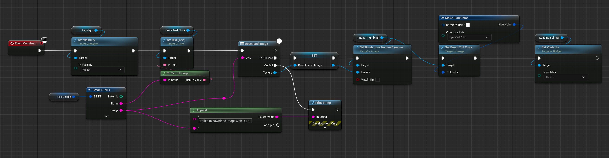
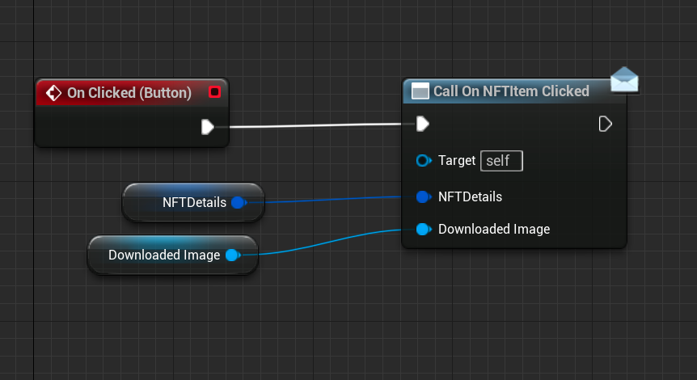
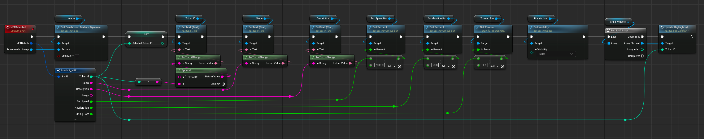
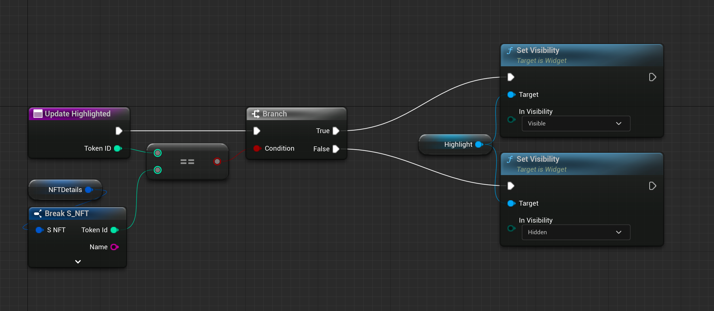
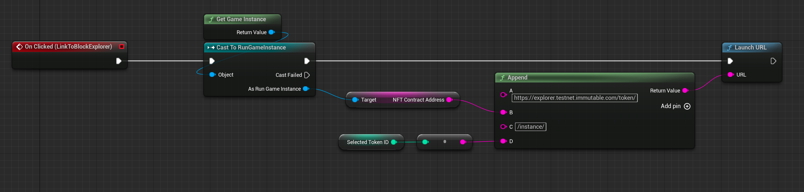

# Lesson 13: Display the NFTs in Game

## Introduction

In this lesson, we will walk through the process of fetching and displaying NFTs within our Unreal Engine game. This will enable players to see their owned NFTs in a dedicated section of the game interface.

## Lesson Objective

By the end of this lesson, you will have implemented functionality to retrieve NFT data from a server and display it within your game interface, allowing players to view and interact with their NFTs.

## Overview

1. Set up HTTP functionality in Unreal Engine.
2. Parse server responses to populate game structures.
3. Display NFTs in the game's user interface.

## Prerequisites

Before starting this lesson, ensure you have completed [Lesson 12: Retrieve NFTs](../12-retrieve-nfts/README.md), where we set up the server endpoint for retrieving NFT data.

## Step-by-Step Instructions

### 1. Enable HTTP in Unreal Engine

To make HTTP requests in Unreal Engine, enable the HTTP Blueprint plugin:

1. Go to **Edit** > **Plugins**.
2. Search for "HTTP".
3. Check the box next to "HTTP Blueprint (Experimental)".

> Note: This plugin is experimental and may cause instability. Consider other HTTP plugins from the Unreal Marketplace if needed.

### 2. Update the NFT Container Widget

We need to modify the NFT Container widget to fetch and display NFTs:

1. **Construct Event**:
    - Grab the game instance.
    - Create an HTTP GET request to retrieve the player's NFTs from the server.
    - Use the endpoint `http://localhost:3000/nfts/<player_IMX_address>`.
    - For each NFT, create a child widget and add it to the Wrap Box component on the left-hand side of the UI.

2. **Parse Get NFTs Response Function**:
    - Convert the JSON response into an array of NFT structs.
    - Iterate through the array to parse each NFT's attributes and populate the struct.

### 3. Update the Child NFT Widget

The child widget will display individual NFT details:

1. **Construct Event**:
    - Hide the "Highlight" element initially.
    - Break apart the NFT Details to set the name and image.
    - Download the image using the URL provided and set it in the widget.

### 4. Implement the On Click Functionality

To display NFT details when an NFT is clicked we want to dispatch an event whenever one of the widgets on the left hand side of the screen is clicked:

1. **Child NFT Widget**:
    - Create an event dispatcher "On NFT Item Clicked" with inputs for NFT Details and Downloaded Image.

2. **NFT Container Widget**:
    - Bind the event dispatcher to each child widget.
    - On click, update the right-hand side of the UI with the selected NFT's details, including token ID, name, description, and custom attributes.
    - Maintain an array of child widgets.
    - Iterate through this array to update the highlight status for each widget based on the selected NFT.

### 5. Highlight the Selected NFT

To indicate which NFT is selected:

1. **Child NFT Widget**:
    - Implement the "Update Highlighted" function to toggle the highlight based on the selected token ID.

### 6. Add a Link to the Immutable Block Explorer

To provide detailed NFT information we add logic to the button in the UI to open a web browser at the URL for the block explorer of the exact NFT.

1. **NFT Container Widget**:
    - Retrieve the NFT contract address from the game instance.
    - Construct a URL for the Immutable block explorer with the construct address and the token ID.
    - Use a Launch URL node to open the link in a web browser.

## Expected Behaviour

1. Run your local minting server
2. Navigate to the "My NFTs" menu.
3. Verify that NFTs are listed on the left-hand side.
4. Click on an NFT to see its details on the right-hand side.
5. Check that the selected NFT is highlighted.
6. Click the link to the block explorer to view detailed information.

**It's important to make sure your local server is running for this functionality to work. In my experience Unreal engine would sometimes crash if the HTTP request failed**

## Conclusion

In this lesson, we successfully integrated NFT retrieval and display functionality into our game. Players can now see their NFTs, view detailed attributes, and access additional information via the Immutable block explorer.

## Next Steps

In the next lesson, we will explore how to use these NFTs as playable characters in the game. [**NFTs as Playable Characters**](../14-nfts-as-playable-characters/README.md).
