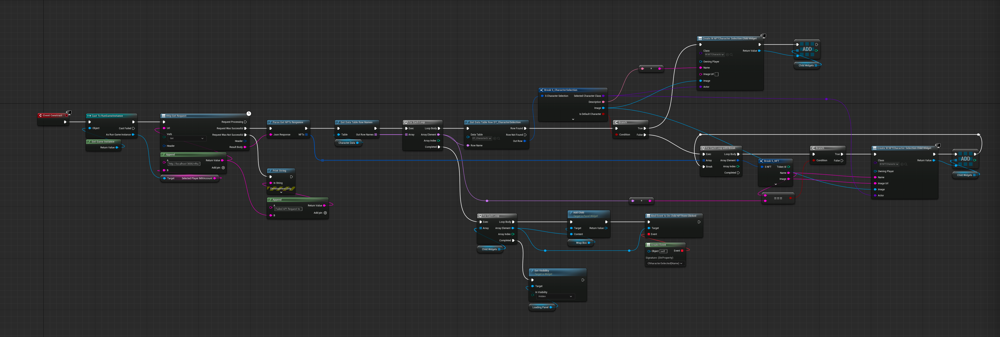

# Lesson 14: NFTs as Playable Characters

## Introduction
In this lesson, we will integrate NFTs as selectable, playable characters within our game. Currently, there's a disconnect between the NFTs in a player's inventory and the characters they can select for gameplay. Our goal is to bridge this gap, ensuring that the NFTs owned by a player are represented as characters in the game.

## Lesson Objective
By the end of this lesson, you will be able to:
- Integrate NFTs as selectable, playable characters within the game.
- Ensure that the character selection screen reflects the NFTs owned by the player.

## Overview
In this lesson, we will:
1. Understand the architecture for character representation.
2. Load NFTs from the server.
3. Update the character selection logic to include NFTs as playable characters.

## Prerequisites
Before you begin, ensure you have completed [Lesson 13: Display the NFTs in Game](../13-display-the-nfts-in-game/README.md). In this lesson, we set up the NFT inventory screen to display the NFTs owned by the player.

## Step-by-Step Instructions

### 1. Understand the Character Architecture
- **Blueprints**: Characters in the game are represented as blueprints. Each blueprint includes the character's animation, skeleton, and properties like turning rate, top speed, acceleration, and the character name.
    - The custom character data is loaded from a data table and used to set properties properties like turning rate, top speed, acceleration during the on construct event of the character.
    - The fox character is the default character and all other character blueprints extend this one.

- **Data Table**: A data table stores the unique values for each character's traits, such as initial speed, top speed, and acceleration. The character name is used to look up the corresponding traits from the data table.
    - This data table has some data duplication with the metadata on the NFT, this is because for the game this made the implementation more straight forward. However with this design the downside is that if you want to update the metadata you need to do it in the game too.
    - There is a boolean column to represent default characters these are characters that are playable whether or not the player owns an NFT for these characters.

- **Struct**: The struct represents the structure of our data in the data table.

### 3. Load NFTs from Server
In the "Character Select Container" widget, we will:

1. Add an HTTP request to fetch the player's NFTs from the server and parse the response (done in the same was as the [previous lesson](../13-display-the-nfts-in-game/README.md))
2. Add a `false` branch to the default character check.
    - If the character isn't default we need to check all of the player's NFTs to see if they can use this character.
    - We match the NFT to the character by comparing the name of the NFT with the name of the character on the data table.
    - If they match, we add the child widget for that character to our array so it will be a selectable element on the left hand side of the screen.

## Expected Behaviour

After implementing the above changes, run the game and navigate to the character selection screen. Ensure that the screen displays both the default characters and the NFTs owned by the player. When selecting a character, the correct character model should appear, and the character should be playable in the game.

## Conclusion

In this lesson, we integrated NFTs as selectable, playable characters within the game. We reviewed the current state of character selection, understood the architecture for character representation, loaded NFTs from the server, and updated the character selection logic.

## Next Steps

In the next lesson, we will explore how to mint NFTs in-game after collecting enough coins. Stay tuned!

Next Lesson: [Mint NFTs In-Game](../15-mint-nfts-in-game/README.md)