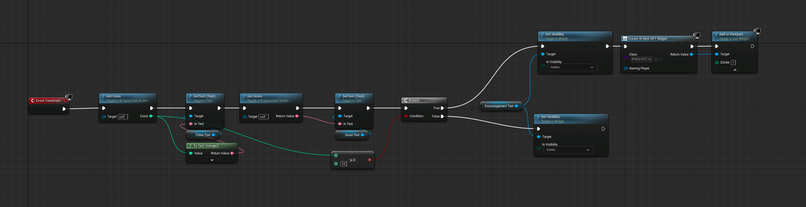
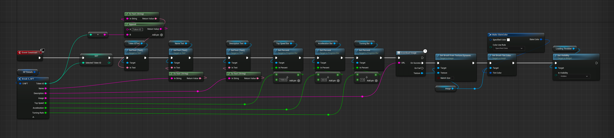
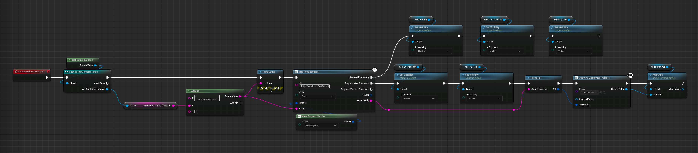

# Lesson 15: Mint NFTs In-Game

## Introduction

In this lesson, we will add the functionality to mint NFTs directly within the game. By the end of this lesson, you will be able to mint an NFT for your player upon meeting specific in-game criteria, such as collecting a certain number of coins during gameplay.

## Lesson Objective

To implement and enable the minting of NFTs directly from the game, using a specific API endpoint.

## Overview

- Walk through the existing setup, focusing on the game over screen and minting logic.
- Implement the minting functionality in the Mint NFT widget.
- Demonstrate the complete minting flow in the game.

## Prerequisites

Make sure you have completed the previous lesson: [**NFTs as Playable Characters**](../14-nfts-as-playable-characters/README.md). In the previous lesson, we integrated NFTs as selectable playable characters within the game, preparing the groundwork for minting new NFTs in this lesson.

## Step-by-Step Instructions

### Walk Through Existing Setup

Navigate to the game over screen to examine the existing widgets and logic:

1. **Game Over Screen Widget**:
   - Checks if the player has collected more than 10 coins.
   - If true, it adds the "Mint NFT" widget to the screen.

2. **Mint NFT Widget**:
   - This is where we will add the logic to mint the NFTs.

3. **Display NFT Widget**:
   - Used for displaying NFT details after minting.
   - Downloads the image from the provided URL and updates the UI.
   - Generates a link to the block explorer for verifying the NFT on the blockchain.

### Implement Minting Functionality

Now, let's implement the minting functionality in the Mint NFT widget:

1. **Construct Event**:
   - Ensure loading indicators are hidden.
   - Grab the game instance to retrieve the player's IMX address.
   - Set the player's address in the UI to show where the NFT will be airdropped.

2. **Mint Click Event**:
   - Construct the JSON body for the minting request by strings with the player's IMX adress.
   - Create an HTTP POST request to the mint endpoint (`http://localhost:3000/mint`).
   - Set the request header to JSON format so the body does not get encoded.
   - Hide the mint button and display loading indicators while processing the request.
   - On success, parse the JSON response to retrieve the NFT details.
   - Create and display the NFT using the Display NFT widget.
   - Hide the loading indicators once the minting process is complete.

## Expected Behaviour

After implementing the minting functionality, follow these steps to test it:

* Collect at least 10 coins during gameplay to trigger the mint screen.
* Verify that the mint button now displays the correct IMX address.
* Click the mint button to mint an NFT.
* Confirm that the newly minted NFT is displayed on the screen.
* Check the block explorer link to verify the NFT on the blockchain.
* Navigate to "My NFTs" to see the new NFT in the inventory.
* Ensure the new NFT is selectable as a playable character from the start menu.

## Conclusion

In this lesson, we have implemented the functionality to mint NFTs directly within the game. We reviewed the existing setup, added the minting logic, and demonstrated the complete minting flow, enabling players to mint new NFTs as rewards for their in-game achievements.